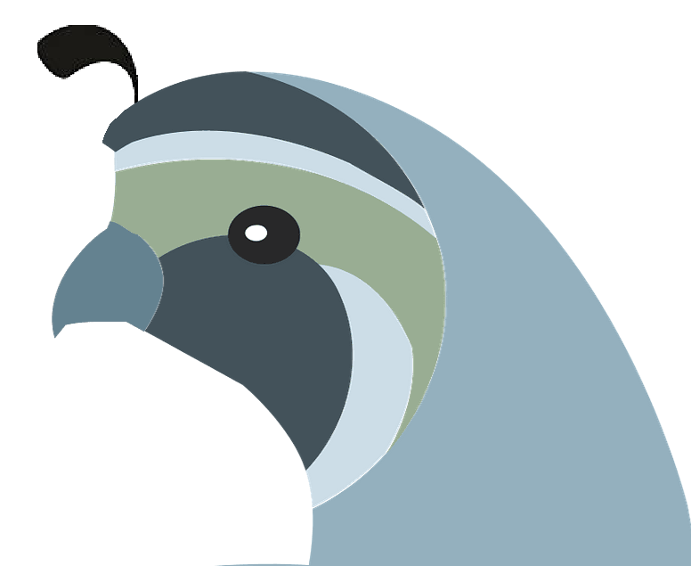

# Libre not Gratis
Liberty, not cheap.

Hub for quail programming, helpful files, and fun projects!\
Welcome to the FOSS future.

## Purpose
Bring man and computer together in harmony.

### The Baby Quail Who Could Not Fly Away [[The Power of Truth, Wholesomeness and Compassion]](https://www.buddhanet.net/e-learning/buddhism/bt1_37/)
*Then the Great Being within the tiny baby quail thought,\
“May this very young innocent truthfulness be united with that ancient purity of wholesomeness and power of Truth.\
May all birds and other beings, who are still trapped by the fire, be saved. And may this spot be safe from fire for a million years!”*\
***And so it was.***

The moral is: Truth, wholesomeness and compassion can save the world.\

Design

quail \

